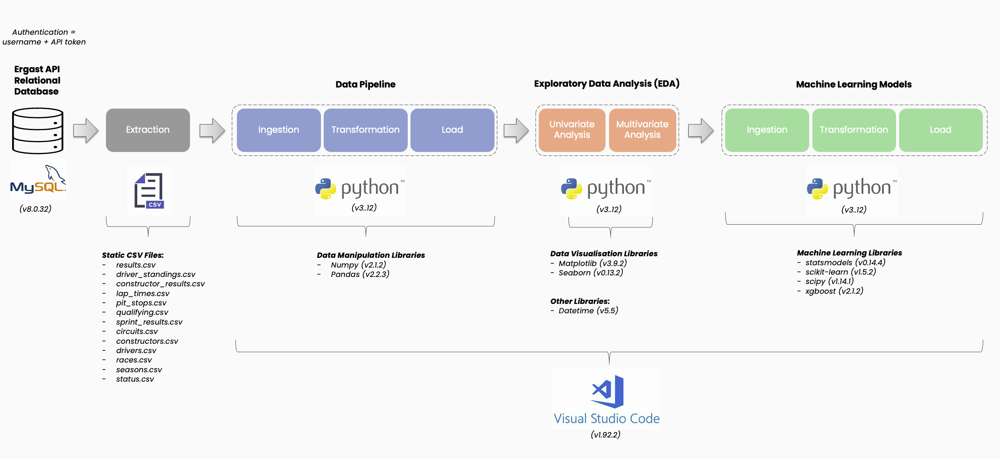

# Formula One Race Predictor


## Executive Summary

Formula 1 (F1) has been a competitive sport since 1950, shaped by technology and race regulations. This project leverages data science to analyse historical F1 data, identifying factors influencing race outcomes and creating a predictive model for driver positions. Unlike similar Kaggle projects that focus on complex models like neural networks, we emphasise Exploratory Data Analysis (EDA) for insights, aiming to guide feature and model selection (starting with simpler models first).

## Data Source Extraction
The dataset for this project was sourced as a set of static CSV files (as at 07/10/2024) from the Ergast’s ["Motor Racing Data API"](https://ergast.com/mrd/db/), which contains F1 data from the beginning of the world championships in 1950 to the present day. 

This dataset was chosen as it contains data going back to 1950 and has a wealth of attributes for analysis as can be seen in the figure 1. It is licensed for non-commercial purposes and is therefore permitted for the research element for this project (Ergast, 2024).


## Data Infrastructure and Tools
Python was selected as the programming language to make use of specialized Python libraries, including Numpy for manipulating data, Pandas for handling data, Matplotlib for generating visualizations, and Scikit-Learn for machine learning. VS Code was used for the IDE together with Jupyter Notebook extensions, to make an incremental approach to processing data easier to manage. Both Python and VS Code are free to use and backed with commercial vendor support.

## The Data Pipeline
The data pipeline loaded source data, replaced missing values and corrected data types, and performed transformations such as merging and grouping data. In summary, it performed a crucial role in preparing the dataset to ensure it was fit-for-purpose before conducting modelling, resulting in better predictive capabilities. 

### Loading Source Data

The extracted CSV files dataset were loaded into a Pandas DataFrame using the `pd.read_csv()` function <insert diagram>.

### Replacing Missing Values and Correcting Datatypes
In F1, driver reference, were recycled 
As an example, the drivers CSV file contained values of "\N" to indicate missing values. For example: the 'driverRef' column in the 'drv' dataframe, was replaced with a pandas equivalent with a value of "pd.NA" as 'driverRef' is of type text <insert diagram>.

Nb. Further examples can be seen in the Jupyter Notebook (located in the GitHub repository).

As an example, the drivers CSV file contained a 'dob' (aka date of birth) column, which was convered from 'object' datatype to to 'datetime' datatype, to ensure strong typing and correct datetime-based calculations later on <insert diagram>.

Nb. Further examples can be seen in the Jupyter Notebook (located in the GitHub repository).

### Merging and Grouping Data
As an example, the race results dataframe was merged with the drivers dataframe, then grouped to plot a bar chart showing the top-10 drivers with highest total career points <insert diagram>,

Nb. Further examples can be seen in the Jupyter Notebook (located in the GitHub repository).

## Explroatory Data Analysis
Given the lack of F1 domain knowledge by the project author, additional focus was spent on EDA to understand: the structure of data, identify and fix data quality issues, and surface F1 race insights. Univariate Analysis (UA) was conducted on each column in each table to understand prior to selecting an initial set of features from which to conduct Multivariate Analysis (MA). 

### Univariate Analysis
Key insights from UA have reinforced the fact that many elements of F1 have changed since 1950 e.g. in the USA different circuits have been raced due to legislation or to make the sport more appealing to sports fans <insrt diagram>.

Total points awarded by season also changed in 2003 and 2010 as can be seen in figure 6. <insert diagram>.

These instances of historical changes are likely to complicate predictive modelling based on supervised learning, where data is split into training and testing sets. Consequently, the project author decided to focus this project on features related to driver performance.
From figures 7 and 8, it can be inferred that a small proportion of the total driver population consistently achieves superior race results. Consequently, feature engineering was employed to create long-term driver performance variables as well as short-term predictor driver performance variables (such as winning the last race or securing pole position in the last race) to serve as signals of driver consistency <insert code & diagrams>.

<insert code & diagrams> show that driver performance is also dependent on driver age, which is why it was also used as a ‘predictor variable’. 

<insert code & diagrams> shows the average driver age has been consistency lower in modern times. A box-plot was used to show potential outliers (figure 12). These will be considered in the second predictive model, MDL02.

### Multivariate Analysis
MA was conducted on the final data-frame containing driver performance variables, to check for correlation: a) visually using seaborn pair-plot to check for distribution, and b) calculating correlation coefficients in the form of a heat-map, where the strongest correlations are highlighted in ‘red’ (see figure 14). Both methods were used as linear regression models assume normal distribution of variables, linearity of variables and variable independence <insert code + diagrams>

### Feature Engineering
Feature engineering transformed provided new features for prediction (Jacob, 2024). New features evaluated driver performance both short and long term (see Figures 3 and 4). 

```python
# Feature Engineering: current_age

# Calc current age for each driver
df_drv['current_age'] = (pd.to_datetime('today') - df_drv['dob_x']).dt.days // 365
df_drv['current_age'] = df_drv['current_age'].astype(int)
```

```python
# Feature Engineering: avg_career_wins

# Calc total wins for each driver
df_results['wins'] = df_results['position'] == 1
df_total_wins = df_results.groupby('driverId')['wins'].sum().reset_index()

# Calc total races for each driver
df_total_races = df_results.groupby('driverId')['raceId'].count().reset_index()
df_total_races.columns = ['driverId', 'total_races']

# Merge total wins and total races
df_drv_wins = pd.merge(df_total_wins, df_total_races, on='driverId')

# Calc average number of career wins
df_drv_wins['avg_career_wins'] = df_drv_wins['wins'] / df_drv_wins['total_races']

# Add avg_career_wins back to df_drv dataframe
df_drv = pd.merge(df_drv, df_drv_wins[['driverId', 'avg_career_wins']], on='driverId', how='left')```

## Final Dataset
<insert diagram here>.

## Hypotheses
<insert diagram here>.

## Predictive Models
Three supervised learning models were used to predict race outcomes, each one attempting to improve results from the previous one.
```

```python
# Feature Engineering: avg_career_pole_pos

# Calc total pole positions for each driver
df_results['pole_pos'] = df_results['grid'] == 1
df_total_pole_pos = df_results.groupby('driverId')['pole_pos'].sum().reset_index()

# Merge total pole positions and total races
df_drv_pole_pos = pd.merge(df_total_pole_pos, df_total_races, on='driverId')

# Calc average number of pole positions
df_drv_pole_pos['avg_career_pole_pos'] = df_drv_pole_pos['pole_pos'] / df_drv_pole_pos['total_races']

# Add avg_career_pole_pos back to df_drv dataframe
df_drv = pd.merge(df_drv, df_drv_pole_pos[['driverId', 'avg_career_pole_pos']], on='driverId', how='left')
```

```python
# Feature Engineering: avg_career_top3_grid_pos

# Calc total top-3 grid positions for each driver
df_results['top3_grid_pos'] = df_results['grid'].isin([1, 2, 3])
df_total_top3_grid_pos = df_results.groupby('driverId')['top3_grid_pos'].sum().reset_index()

# Merge total top-3 grid positions and total races
df_drv_grid_pos = pd.merge(df_total_top3_grid_pos, df_total_races, on='driverId')

# Calc average number of top-3 grid positions
df_drv_grid_pos['avg_career_top3_grid_pos'] = df_drv_grid_pos['top3_grid_pos'] / df_drv_grid_pos['total_races']

# Add avg_career_top3_grid_pos back to df_drv dataframe
df_drv = pd.merge(df_drv, df_drv_grid_pos[['driverId', 'avg_career_top3_grid_pos']], on='driverId', how='left')
```

```python
# Feature Engineering: Add drv_won_last_race column

# Merge results with races to retrieve race season
df_res = pd.merge(df_results, df_races, on='raceId', how='left')

# Sort all race results by driver + year + race id
df_res = df_res.sort_values(['driverId', 'year_x', 'raceId'])

# Use window funtion to calc whether driver won last race by seeing if previous race result position was first
df_drv['won_last_race'] = df_res.groupby('driverId')['position'].shift(1) == 1
df_drv['won_last_race'] = df_drv['won_last_race'].fillna(False).astype(int)
```

```python
# Feature Engineering: Add drv_pole_pos_last_race column

# Merge results with races to retrieve race season
df_res = pd.merge(df_results, df_races, on='raceId', how='left')

# Sort all race results by driver + year + race id
df_res = df_res.sort_values(['driverId', 'year_x', 'raceId'])

# Use window function to calc whether driver has pole position for last race by seeing if previous race grid position was first
df_drv['pole_pos_last_race'] = df_res.groupby('driverId')['grid'].shift(1) == 1
df_drv['pole_pos_last_race'] = df_drv['pole_pos_last_race'].fillna(False).astype(int)```
