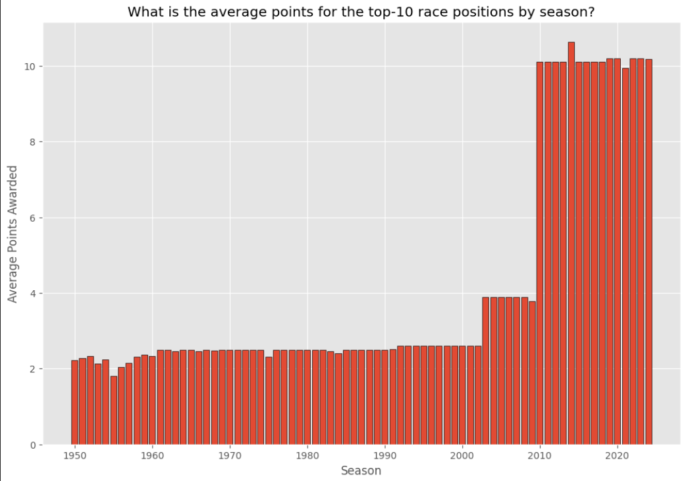
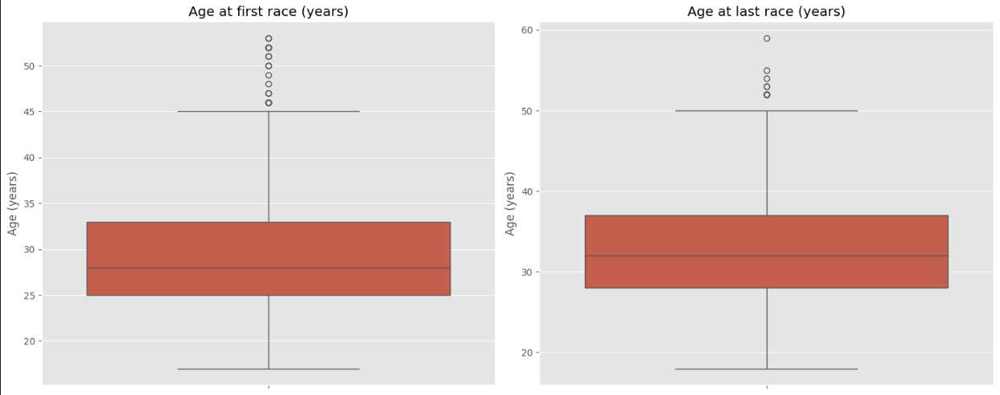

# Formula One Race Predictor


## Executive Summary

Formula 1 (F1) has been a competitive sport since 1950, shaped by substantive changes in technology and race regulations. This project leverages data science to analyse publicly available F1 data, to identify features that most influence race outcomes by creating supervised learning models to predict race finishing positions. Unlike similar Kaggle projects that focus on complex models like neural networks, this project emphasises Exploratory Data Analysis (EDA) to guide feature and model selection. 

The findings may be of use to betting companies where F1 betting is becoming a more popular (TODO: add source) - however, alternative data should be sought if used for commercial purposes.

## Data Source Selection
Data from the Ergast-MRD API (ERG-API) was chosen as it contains F1 data going back to the official start of the championships in 1950 to the present day and has a rich set of potential features / variables for analysis, as can be seen in the figure 1. It is publicly available and licensed for non-commercial purposes and is therefore permitted for use by this project (Ergast, 2024).

<sub>Figure 1 - Ergast API database entity relationship diagram (Ergast, 2024).</sup>

## Data Infrastructure and Tools
Python was selected as the programming language to take advantage of specialist Python libraries, including Numpy for manipulating data, Pandas for handling data, Matplotlib for generating visualizations, and Scikit-Learn for machine learning. VS Code was used for the Python IDE together with Jupyter Notebook extensions, to enable an incremental approach to processing data easier e.g. using cell-based execution of Python scripts. Both Python and VS Code are free to use and backed up by  commercial vendor support.

For extraction of source data, firewall restrictions in the organisational ecosystem prevented use of Python scripts to invoke the ERG-API. Unfortunately, this meant that an automated data pipeline was not possible which would have loaded latest F1 data into the respective models. Instead, a workaround was put in place, consisting of downloading the data as static CSV text files (as at 07/102024) instead, which are the ERG-API also makes available ["Motor Racing Data API"](https://ergast.com/mrd/db/). As well the latest data not being loaded, additional processing was required in the data pipeline because ERG-API uses MySQL as a relational database and the dimension and fact tables are stored as separate CSV files, rather than invoking the API to process joining of tables from MySQL itself before loading the data. 

## The E2E Data Science Process
Figure 2 shows the end-to-end data science process including the data pipeline. The data pipeline played was pivotal to not only load the source data but also to check and treat data quality issues, and perform data transformations to aid analysis and feature engineering. For example, missing values for 'driverRef' were replaced, incorrect data type for 'dob' corrected, and data transformations such as merging and grouping 'resultsl with 'drivers' data for driver performance analysis. Without the data pipeline performing such functions, the quality of Exploratory Data Analysis (EDA) to inform initialy business insights or inform model/feature selection or indeed model results may have been compromised (TODO: add source).
 

<sub>Figure 2 - End-to-end data science process.</sup>

### Loading Source Data

The CSV files were loaded into a Pandas dataframe using the `pd.read_csv()` function from the Pandas library. Pandas was chosen as it offers functions for analyzing, cleaning, exploring, and manipulating data in a simple table-like structure for inspection, which makes it ideal for EDA (Altexsoft, 2024 - https://www.altexsoft.com/blog/pandas-library/). Example Python script for loading the drivers.csv text file is shown in figure 3.

```python
# Declare functions

# Function to load specific source data files into global variables
# TODO: Change data ingestion from loading static csv files to API calls.
def load_data():
  
    global df_drv

    try:
        df_drv = pd.read_csv('Data/drivers.csv')
    except FileNotFoundError:
        print("Error: 'drivers.csv' file not found.")
    except pd.errors.EmptyDataError:
        print("Error: 'drivers.csv' file is empty.")
    except Exception as e:
        print(f"Error loading 'drivers.csv': {e}")
```

```python
# Load source data
load_data()
```
<sub>Figure 3 - Python script for loading drivers.csv text file.</sup>

### Data Quality
The data pipeline identified and treated data quality issues where necessary e.g. checking and replacing missing values, checking and fixing incorrect data types. Example Python script for replacing missing values for the 'driverRef' column (stored as "\N" 'in drivers.csv') with "pd.NA", and changing the datatype for the 'dob' column is shown in figure 4. 

```python
# EDA for Drivers dataset: structure of the data & quality of the data - summary statistics & check uniqueness / missing values / datatype / format
stats = df_drv.describe()
print(df_drv.shape), print(df_drv), print(stats)

# Check 'number' column for missing values
df_drv['number'].unique

# Check 'driverRef' column for missing values
df_drv['driverRef'].unique

# Replace missing values ('\N') in 'number' column with 'NaN' and convert to numeric datatype
df_drv['number'] = df_drv['number'].replace('\\N', pd.NA)
df_drv['number'] = pd.to_numeric(df_drv['number'], errors='coerce')

# Fix datatypes for numerical or datetime columns
df_drv['dob'] = pd.to_datetime(df_drv['dob'])
```
<sub>Figure 4 - Python scipt for replacing missing values for 'driverRef' column and changing the datatype for the 'dob' column in the 'df_drv' pandas data frame.</sup>

### Data Transformations
The data pipeline also performed transformations to the data to reveal quick insights e.g. the 'df_results' and 'df_drv' data frames were merged together and grouped by 'driverRef' and 'points' to plot a bar chart showing the top-10 drivers with highest total career points and a line chart to show their relative ranking (figure 5).

```python
# EDA for Drivers dataset: key business insight - top-10 drivers with highest career points

# Merge results with drivers to get 'driverRef'
df_pts = pd.merge(df_results, df_drv, on='driverId', how='right')

# Use 'driverRef' to calc total points
df_pts_grp = df_pts.groupby('driverRef')['points'].sum().reset_index()

# Remove drivers with no points
df_pts_grp_filtered = df_pts_grp[df_pts_grp['points'] > 0]

# Sorted from largest to smallest by points
df_pts_grp_sorted = df_pts_grp_filtered.sort_values(by='points', ascending=False)

# Filter for the top 10 drivers
df_top_drv = df_pts_grp_sorted.head(10)

# Plot bar chart
plt.figure(figsize=(45, 6))
sns.barplot(x='driverRef', y='points', data=df_top_drv)
plt.title('Top-10 drivers with highest career points')
plt.xlabel('Constructor')
plt.ylabel('Points')
plt.xticks(rotation=45)
plt.show()
```

<sub>Figure 5 - Python script for merging 'df_results' and 'df_drv' dataframes together, then grouping by 'driverRef' and 'points'.</sup>

## Exploratory Data Analysis
There was a deliberate focus on EDA to understand given the lack of F1 domain knowledge by the project author. Univariate Analysis (UA) was conducted on each column for each table to identify the structure of the data e.g. size and shape, uniqueness, distribuion, outliers etc, and to surface quick insights e.g plotting relevant charts to visually show simple relationships between potential features and the target variable. These were then analysed further using Multivariate Analysis (MA) to identify more complex relationships between features and the target variable, and to inform final model and feature selection (Statology, 2024 - https://www.statology.org/univariate-vs-multivariate-analysis/). 

Nb. Ad-hoc reviews took place with a member of a McLaren Racing staff to seek subject matter expertise and support interpretation F1 rules and regulation for context).

### Univariate Analysis (UA)
Key insights from UA underline the fact that many elements of F1 have changed since 1950 e.g. in the USA different circuits have been raced due to legislation or to make the sport more appealing to sports fans (figure 5).


For the race format, points awarded by season also changed in 2003 and 2010 as can be seen in figure 6. The reasons were due to deliberate (Wikipedia, 2024 - https://en.wikipedia.org/wiki/List_of_Formula_One_World_Championship_points_scoring_systems).


<sub>Figure 6 - Bar Charts showing total points awarded by season and average points awarded to top-10 finishing positions by season.</sup>

Upon complietion of UA, similar changes were exhibited for number of races per season, constructors re-branding themselves, which circuits are included each season, etc (see EDA_UA01 - EDA_UA-09 sections in Jupyter Notebook for details). If included for predictive modelling, these features are likely to adversely impact the reliability of model results, given the use of supervised learning models (where data is labelled as training vs test data). Consequently, it was decided to to focus this project on features related to driver-related features, as these have been more consistent over time.

### Univariate Analysis for Driver-Related Features
Figure 6 uses a histogram to show the distribution of driver age in terms of when they start their first compared to their most last race. Figure 7 also uses a histogram to show the distribuion of driver age for those drivers that have won a race. 

```python
# EDA for Drivers dataset: key business insight - What is the distribution of driver age when they first raced versus age when they last raced (in years)?

# Merge driver standings with drivers and races to retrieve dob
df_age1 = pd.merge(df_drv_standings, df_drv, on='driverId', how='right')
df_age2 = pd.merge(df_age1, df_races, on='raceId', how='right')

# Use dob to calculate driver date of first race & driver date of last race
df_age_grp = df_age2.groupby('driverId').agg(fr_date=('date', 'min'), lr_date=('date', 'max'), dob=('dob', 'first')).reset_index()

# Fix datatypes for numerical or datetime columns
df_age_grp['fr_date'] = pd.to_datetime(df_age_grp['fr_date'])
df_age_grp['lr_date'] = pd.to_datetime(df_age_grp['lr_date'])

# Feature engineering - use driver dob to calculate driver age at first race & age at last race
df_age_grp['age_first_race'] = (df_age_grp['fr_date'] - df_age_grp['dob']).dt.days // 365
df_age_grp['age_last_race'] = (df_age_grp['lr_date'] - df_age_grp['dob']).dt.days // 365

# Plot histogram
plt.figure(figsize=(10, 6))
plt.hist(df_age_grp['age_first_race'], alpha=0.5, label='Age at First Race')
plt.hist(df_age_grp['age_last_race'], alpha=0.5, label='Age at Last Race')
plt.title('What is the distribution of driver age when they first raced race vs. when they last raced (years)?')
plt.xlabel('Age (years)')
plt.ylabel('Count')
plt.xticks(rotation=45)
plt.legend(loc='upper right')
plt.show()

# Feature engineering - add age at first race & age at last race back to original dataset. 
df_drv = pd.merge(df_drv, df_age_grp, on='driverId', how='left')
```
<sub>Figure 6 - Python script to show distribution of driver age at first / last race.</sup>

<insert code & diagrams> shows the average driver age has been consistency lower in modern times. A box-plot was used to show potential outliers (figure 12). These will be considered in the second predictive model, MDL02.


```python
# EDA for Drivers dataset: key business insight - at what age do drivers start their first race versus last race (in years)?

# Set up fig space for 2 box plots
fig, axes = plt.subplots(1, 2, figsize=(15, 6))

# Box plot for drv age at first race
sns.boxplot(data=df_age_grp, y='age_first_race', ax=axes[0])
axes[0].set_title('Age at first race (years)')
axes[0].set_ylabel('Age (years)')

# Box plot for drv age at last race
sns.boxplot(data=df_age_grp, y='age_last_race', ax=axes[1])
axes[1].set_title('Age at last race (years)')
axes[1].set_ylabel('Age (years)')

plt.tight_layout()
plt.show()
```


```python
# EDA for Drivers dataset: key business insight - what is the distribution of winner driver age (in years)?

# Merge driver standings with drivers and races to retrieve dob for winning drivers
df_win_age1 = pd.merge(df_drv_standings[df_drv_standings['position'] == 1], df_drv, on='driverId', how='left')
df_win_age2 = pd.merge(df_win_age1, df_races, on='raceId', how='left')

# Ensure the date columns are in datetime format
df_win_age2['dob_x'] = pd.to_datetime(df_win_age2['dob_x'])
df_win_age2['date'] = pd.to_datetime(df_win_age2['date'])

# Use dob for winning drivers to calculate driver age at the time of the race
df_win_age2['race_age'] = (df_win_age2['date'] - df_win_age2['dob_x']).dt.days // 365
df_win_age2['race_age'] = df_win_age2['race_age'].astype(int)

# Plot histogram
plt.figure(figsize=(10, 6))
plt.hist(df_win_age2['race_age'].dropna(), bins=10, alpha=0.5, label='Race Win Age')
plt.title('What is the distribution of Winning Driver Age (years)?')
plt.xlabel('Age (years)')
plt.ylabel('Count')
plt.xticks(rotation=45)
plt.legend(loc='upper right')
plt.show()```
```


```python
# EDA for Drivers dataset: key business insight - what is the average driver age (years) by season?

# Merge driver standings with drivers and races to retrieve 'dob'
df_avg_age1 = pd.merge(df_drv_standings, df_drv, on='driverId', how='left')
df_avg_age2 = pd.merge(df_avg_age1, df_races[['raceId', 'year', 'date']], on='raceId', how='left')

# Convert 'dob' and race 'date' to datetime
df_avg_age2['dob_x'] = pd.to_datetime(df_avg_age2['dob_x'])
df_avg_age2['date'] = pd.to_datetime(df_avg_age2['date'])

# Calculate driver age in each race
df_avg_age2['age'] = df_avg_age2['date'].dt.year - df_avg_age2['dob_x'].dt.year

# Feature engineering - group by year and calculate the average age of drivers
df_avg_age_per_season = df_avg_age2.groupby('year')['age'].mean()

# Line Plot
plt.figure(figsize=(10, 6))
df_avg_age_per_season.plot(kind='line', marker='o')
plt.xlabel('Season')
plt.ylabel('Average Driver Age')
plt.title('What is the average driver age (years) by season?')
plt.grid(True)
plt.show()

# Feature engineering - add age at back to original dataset. 
df_drv = pd.merge(df_drv, df_age_grp, on='driverId', how='left')
```


### Multivariate Analysis
MA was conducted on the final data-frame containing driver performance variables, to check for correlation: a) visually using seaborn pair-plot to check for distribution, and b) calculating correlation coefficients in the form of a heat-map, where the strongest correlations are highlighted in ‘red’ (see figure 14). Both methods were used as linear regression models assume normal distribution of variables, linearity of variables and variable independence <insert code + diagrams>

### Feature Engineering
Consequently, feature engineering was employed to create long-term driver performance variables as well as short-term predictor driver performance variables (such as winning the last race or securing pole position in the last race) to serve as signals of driver consistency <insert code & diagrams>.

Feature engineering transformed provided new features for prediction (Jacob, 2024). New features evaluated driver performance both short and long term (see Figures 3 and 4). 

```python
# Feature Engineering: current_age

# Calc current age for each driver
df_drv['current_age'] = (pd.to_datetime('today') - df_drv['dob_x']).dt.days // 365
df_drv['current_age'] = df_drv['current_age'].astype(int)
```

```python
# Feature Engineering: avg_career_wins

# Calc total wins for each driver
df_results['wins'] = df_results['position'] == 1
df_total_wins = df_results.groupby('driverId')['wins'].sum().reset_index()

# Calc total races for each driver
df_total_races = df_results.groupby('driverId')['raceId'].count().reset_index()
df_total_races.columns = ['driverId', 'total_races']

# Merge total wins and total races
df_drv_wins = pd.merge(df_total_wins, df_total_races, on='driverId')

# Calc average number of career wins
df_drv_wins['avg_career_wins'] = df_drv_wins['wins'] / df_drv_wins['total_races']

# Add avg_career_wins back to df_drv dataframe
df_drv = pd.merge(df_drv, df_drv_wins[['driverId', 'avg_career_wins']], on='driverId', how='left')```

## Final Dataset
<insert diagram here>.

## Hypotheses
<insert diagram here>.

## Predictive Models
Three supervised learning models were used to predict race outcomes, each one attempting to improve results from the previous one.
```

```python
# Feature Engineering: avg_career_pole_pos

# Calc total pole positions for each driver
df_results['pole_pos'] = df_results['grid'] == 1
df_total_pole_pos = df_results.groupby('driverId')['pole_pos'].sum().reset_index()

# Merge total pole positions and total races
df_drv_pole_pos = pd.merge(df_total_pole_pos, df_total_races, on='driverId')

# Calc average number of pole positions
df_drv_pole_pos['avg_career_pole_pos'] = df_drv_pole_pos['pole_pos'] / df_drv_pole_pos['total_races']

# Add avg_career_pole_pos back to df_drv dataframe
df_drv = pd.merge(df_drv, df_drv_pole_pos[['driverId', 'avg_career_pole_pos']], on='driverId', how='left')
```

```python
# Feature Engineering: avg_career_top3_grid_pos

# Calc total top-3 grid positions for each driver
df_results['top3_grid_pos'] = df_results['grid'].isin([1, 2, 3])
df_total_top3_grid_pos = df_results.groupby('driverId')['top3_grid_pos'].sum().reset_index()

# Merge total top-3 grid positions and total races
df_drv_grid_pos = pd.merge(df_total_top3_grid_pos, df_total_races, on='driverId')

# Calc average number of top-3 grid positions
df_drv_grid_pos['avg_career_top3_grid_pos'] = df_drv_grid_pos['top3_grid_pos'] / df_drv_grid_pos['total_races']

# Add avg_career_top3_grid_pos back to df_drv dataframe
df_drv = pd.merge(df_drv, df_drv_grid_pos[['driverId', 'avg_career_top3_grid_pos']], on='driverId', how='left')
```

```python
# Feature Engineering: Add drv_won_last_race column

# Merge results with races to retrieve race season
df_res = pd.merge(df_results, df_races, on='raceId', how='left')

# Sort all race results by driver + year + race id
df_res = df_res.sort_values(['driverId', 'year_x', 'raceId'])

# Use window funtion to calc whether driver won last race by seeing if previous race result position was first
df_drv['won_last_race'] = df_res.groupby('driverId')['position'].shift(1) == 1
df_drv['won_last_race'] = df_drv['won_last_race'].fillna(False).astype(int)
```

```python
# Feature Engineering: Add drv_pole_pos_last_race column

# Merge results with races to retrieve race season
df_res = pd.merge(df_results, df_races, on='raceId', how='left')

# Sort all race results by driver + year + race id
df_res = df_res.sort_values(['driverId', 'year_x', 'raceId'])

# Use window function to calc whether driver has pole position for last race by seeing if previous race grid position was first
df_drv['pole_pos_last_race'] = df_res.groupby('driverId')['grid'].shift(1) == 1
df_drv['pole_pos_last_race'] = df_drv['pole_pos_last_race'].fillna(False).astype(int)```
