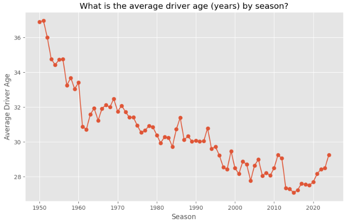

# Formula One Race Predictor


## Executive Summary

Formula 1 (F1) has been a competitive sport since 1950, shaped by technology and race regulations. This project leverages data science to analyse historical F1 data, identifying factors influencing race outcomes and creating a predictive model for driver positions. Unlike similar Kaggle projects that focus on complex models like neural networks, we emphasise Exploratory Data Analysis (EDA) for insights, aiming to guide feature and model selection (starting with simpler models first).

## Data Source Extraction
The dataset for this project was sourced as a set of static CSV files (as at 07/10/2024) from the Ergast’s ["Motor Racing Data API"](https://ergast.com/mrd/db/), which contains F1 data from the beginning of the world championships in 1950 to the present day. 

This dataset was chosen as it contains data going back to the start of F1 in 1950 and has a wealth of attributes for analysis as can be seen in the figure 1. It is licensed for non-commercial purposes and is therefore permitted for the research element for this project (Ergast, 2024).

<sub>Figure 1 - Ergast API database entity relationship diagram (Ergast, 2024).</sup>

## Data Infrastructure and Tools
Python was selected as the programming language to make use of specialized Python libraries, including Numpy for manipulating data, Pandas for handling data, Matplotlib for generating visualizations, and Scikit-Learn for machine learning. VS Code was used for the IDE together with Jupyter Notebook extensions, to make an incremental approach to processing data easier to manage. Both Python and VS Code are free to use and backed with commercial vendor support.

## The Data Pipeline as Part of the E2E Data Science Process
The data pipeline loaded source data, replaced missing values and corrected data types where necessary, and performed transformations such as merging and grouping data. In summary, it performed a crucial role in preparing the dataset to ensure it was fit-for-purpose before conducting modelling, resulting in better predictive capabilities.  

<sub>Figure 2 - End-to-end data science process.</sup>

### Loading Source Data

The extracted CSV files dataset were loaded into a Pandas DataFrame using the `pd.read_csv()` function. An example for loading the drivers.csv text file is shown in figure 3.

```python
# Declare functions

# Function to load specific source data files into global variables
# TODO: Change data ingestion from loading static csv files to API calls.
def load_data():
  
    global df_drv

    try:
        df_drv = pd.read_csv('Data/drivers.csv')
    except FileNotFoundError:
        print("Error: 'drivers.csv' file not found.")
    except pd.errors.EmptyDataError:
        print("Error: 'drivers.csv' file is empty.")
    except Exception as e:
        print(f"Error loading 'drivers.csv': {e}")
```

```python
# Load source data
load_data()
```
<sub>Figure 3 - Python script for loading drivers.csv text file.</sup>

### Conducting Data Quality Checks
The data pipeline conducted a number of data quality checks where necessary e.g. checking and replacing missing values, checking and fixing incorrect data types. Examples include, replacing missing values for the 'driverRef' column (stored as "\N" 'in drivers.csv') with "pd.NA", and changing the datatype for the 'dob' column (figure 4). 

```python
# EDA for Drivers dataset: structure of the data & quality of the data - summary statistics & check uniqueness / missing values / datatype / format
stats = df_drv.describe()
print(df_drv.shape), print(df_drv), print(stats)

# Check 'number' column for missing values
df_drv['number'].unique

# Check 'driverRef' column for missing values
df_drv['driverRef'].unique

# Replace missing values ('\N') in 'number' column with 'NaN' and convert to numeric datatype
df_drv['number'] = df_drv['number'].replace('\\N', pd.NA)
df_drv['number'] = pd.to_numeric(df_drv['number'], errors='coerce')

# Fix datatypes for numerical or datetime columns
df_drv['dob'] = pd.to_datetime(df_drv['dob'])
```
<sub>Figure 4 - Python scipt for replacing missing values for 'driverRef' column and changing the datatype for the 'dob' column in the 'df_drv' pandas data frame.</sup>

### Data Transformations
The data pipeline also performed transformations to the data as required e.g. the 'df_results' and 'df_drv' data frames were merged together and grouped by 'driverRef' and 'points' to plot a bar chart showing the top-10 drivers with highest total career points and a line chart to show their relative ranking (figure 5).

```python
# EDA for Drivers dataset: key business insight - top-10 drivers with highest career points

# Merge results with drivers to get 'driverRef'
df_pts = pd.merge(df_results, df_drv, on='driverId', how='right')

# Use 'driverRef' to calc total points
df_pts_grp = df_pts.groupby('driverRef')['points'].sum().reset_index()

# Remove drivers with no points
df_pts_grp_filtered = df_pts_grp[df_pts_grp['points'] > 0]

# Sorted from largest to smallest by points
df_pts_grp_sorted = df_pts_grp_filtered.sort_values(by='points', ascending=False)

# Filter for the top 10 drivers
df_top_drv = df_pts_grp_sorted.head(10)

# Plot bar chart
plt.figure(figsize=(45, 6))
sns.barplot(x='driverRef', y='points', data=df_top_drv)
plt.title('Top-10 drivers with highest career points')
plt.xlabel('Constructor')
plt.ylabel('Points')
plt.xticks(rotation=45)
plt.show()
```

<sub>Figure 5 - Python script for merging 'df_results' and 'df_drv' dataframes together, then grouping by 'driverRef' and 'points'.</sup>

## Exploratory Data Analysis
Given the lack of F1 domain knowledge by the project author, additional focus was spent on EDA to understand: the structure of data, identify and fix data quality issues, and surface F1 race insights. Univariate Analysis (UA) was conducted on each column in each table to understand prior to selecting an initial set of features from which to conduct Multivariate Analysis (MA). 

### Univariate Analysis
Key insights from UA have reinforced the fact that many elements of F1 have changed since 1950 e.g. in the USA different circuits have been raced due to legislation or to make the sport more appealing to sports fans.

Total points awarded by season also changed in 2003 and 2010.


These instances of historical changes are likely to complicate predictive modelling based on supervised learning, where data is split into training and testing sets. Consequently, the project author decided to focus this project on features related to driver performance.
From figures 7 and 8, it can be inferred that a small proportion of the total driver population consistently achieves superior race results. Consequently, feature engineering was employed to create long-term driver performance variables as well as short-term predictor driver performance variables (such as winning the last race or securing pole position in the last race) to serve as signals of driver consistency <insert code & diagrams>.

<insert code & diagrams> show that driver performance is also dependent on driver age, which is why it was also used as a ‘predictor variable’. 
```python
# EDA for Drivers dataset: key business insight - What is the distribution of driver age when they first raced versus age when they last raced (in years)?

# Merge driver standings with drivers and races to retrieve dob
df_age1 = pd.merge(df_drv_standings, df_drv, on='driverId', how='right')
df_age2 = pd.merge(df_age1, df_races, on='raceId', how='right')

# Use dob to calculate driver date of first race & driver date of last race
df_age_grp = df_age2.groupby('driverId').agg(fr_date=('date', 'min'), lr_date=('date', 'max'), dob=('dob', 'first')).reset_index()

# Fix datatypes for numerical or datetime columns
df_age_grp['fr_date'] = pd.to_datetime(df_age_grp['fr_date'])
df_age_grp['lr_date'] = pd.to_datetime(df_age_grp['lr_date'])

# Feature engineering - use driver dob to calculate driver age at first race & age at last race
df_age_grp['age_first_race'] = (df_age_grp['fr_date'] - df_age_grp['dob']).dt.days // 365
df_age_grp['age_last_race'] = (df_age_grp['lr_date'] - df_age_grp['dob']).dt.days // 365

# Plot histogram
plt.figure(figsize=(10, 6))
plt.hist(df_age_grp['age_first_race'], alpha=0.5, label='Age at First Race')
plt.hist(df_age_grp['age_last_race'], alpha=0.5, label='Age at Last Race')
plt.title('What is the distribution of driver age when they first raced race vs. when they last raced (years)?')
plt.xlabel('Age (years)')
plt.ylabel('Count')
plt.xticks(rotation=45)
plt.legend(loc='upper right')
plt.show()

# Feature engineering - add age at first race & age at last race back to original dataset. 
df_drv = pd.merge(df_drv, df_age_grp, on='driverId', how='left')
```

<insert code & diagrams> shows the average driver age has been consistency lower in modern times. A box-plot was used to show potential outliers (figure 12). These will be considered in the second predictive model, MDL02.


```python
# EDA for Drivers dataset: key business insight - at what age do drivers start their first race versus last race (in years)?

# Set up fig space for 2 box plots
fig, axes = plt.subplots(1, 2, figsize=(15, 6))

# Box plot for drv age at first race
sns.boxplot(data=df_age_grp, y='age_first_race', ax=axes[0])
axes[0].set_title('Age at first race (years)')
axes[0].set_ylabel('Age (years)')

# Box plot for drv age at last race
sns.boxplot(data=df_age_grp, y='age_last_race', ax=axes[1])
axes[1].set_title('Age at last race (years)')
axes[1].set_ylabel('Age (years)')

plt.tight_layout()
plt.show()
```


```python
# EDA for Drivers dataset: key business insight - what is the distribution of winner driver age (in years)?

# Merge driver standings with drivers and races to retrieve dob for winning drivers
df_win_age1 = pd.merge(df_drv_standings[df_drv_standings['position'] == 1], df_drv, on='driverId', how='left')
df_win_age2 = pd.merge(df_win_age1, df_races, on='raceId', how='left')

# Ensure the date columns are in datetime format
df_win_age2['dob_x'] = pd.to_datetime(df_win_age2['dob_x'])
df_win_age2['date'] = pd.to_datetime(df_win_age2['date'])

# Use dob for winning drivers to calculate driver age at the time of the race
df_win_age2['race_age'] = (df_win_age2['date'] - df_win_age2['dob_x']).dt.days // 365
df_win_age2['race_age'] = df_win_age2['race_age'].astype(int)

# Plot histogram
plt.figure(figsize=(10, 6))
plt.hist(df_win_age2['race_age'].dropna(), bins=10, alpha=0.5, label='Race Win Age')
plt.title('What is the distribution of Winning Driver Age (years)?')
plt.xlabel('Age (years)')
plt.ylabel('Count')
plt.xticks(rotation=45)
plt.legend(loc='upper right')
plt.show()```
```


```python
# EDA for Drivers dataset: key business insight - what is the average driver age (years) by season?

# Merge driver standings with drivers and races to retrieve 'dob'
df_avg_age1 = pd.merge(df_drv_standings, df_drv, on='driverId', how='left')
df_avg_age2 = pd.merge(df_avg_age1, df_races[['raceId', 'year', 'date']], on='raceId', how='left')

# Convert 'dob' and race 'date' to datetime
df_avg_age2['dob_x'] = pd.to_datetime(df_avg_age2['dob_x'])
df_avg_age2['date'] = pd.to_datetime(df_avg_age2['date'])

# Calculate driver age in each race
df_avg_age2['age'] = df_avg_age2['date'].dt.year - df_avg_age2['dob_x'].dt.year

# Feature engineering - group by year and calculate the average age of drivers
df_avg_age_per_season = df_avg_age2.groupby('year')['age'].mean()

# Line Plot
plt.figure(figsize=(10, 6))
df_avg_age_per_season.plot(kind='line', marker='o')
plt.xlabel('Season')
plt.ylabel('Average Driver Age')
plt.title('What is the average driver age (years) by season?')
plt.grid(True)
plt.show()

# Feature engineering - add age at back to original dataset. 
df_drv = pd.merge(df_drv, df_age_grp, on='driverId', how='left')
```



### Multivariate Analysis
MA was conducted on the final data-frame containing driver performance variables, to check for correlation: a) visually using seaborn pair-plot to check for distribution, and b) calculating correlation coefficients in the form of a heat-map, where the strongest correlations are highlighted in ‘red’ (see figure 14). Both methods were used as linear regression models assume normal distribution of variables, linearity of variables and variable independence <insert code + diagrams>

### Feature Engineering
Feature engineering transformed provided new features for prediction (Jacob, 2024). New features evaluated driver performance both short and long term (see Figures 3 and 4). 

```python
# Feature Engineering: current_age

# Calc current age for each driver
df_drv['current_age'] = (pd.to_datetime('today') - df_drv['dob_x']).dt.days // 365
df_drv['current_age'] = df_drv['current_age'].astype(int)
```

```python
# Feature Engineering: avg_career_wins

# Calc total wins for each driver
df_results['wins'] = df_results['position'] == 1
df_total_wins = df_results.groupby('driverId')['wins'].sum().reset_index()

# Calc total races for each driver
df_total_races = df_results.groupby('driverId')['raceId'].count().reset_index()
df_total_races.columns = ['driverId', 'total_races']

# Merge total wins and total races
df_drv_wins = pd.merge(df_total_wins, df_total_races, on='driverId')

# Calc average number of career wins
df_drv_wins['avg_career_wins'] = df_drv_wins['wins'] / df_drv_wins['total_races']

# Add avg_career_wins back to df_drv dataframe
df_drv = pd.merge(df_drv, df_drv_wins[['driverId', 'avg_career_wins']], on='driverId', how='left')```

## Final Dataset
<insert diagram here>.

## Hypotheses
<insert diagram here>.

## Predictive Models
Three supervised learning models were used to predict race outcomes, each one attempting to improve results from the previous one.
```

```python
# Feature Engineering: avg_career_pole_pos

# Calc total pole positions for each driver
df_results['pole_pos'] = df_results['grid'] == 1
df_total_pole_pos = df_results.groupby('driverId')['pole_pos'].sum().reset_index()

# Merge total pole positions and total races
df_drv_pole_pos = pd.merge(df_total_pole_pos, df_total_races, on='driverId')

# Calc average number of pole positions
df_drv_pole_pos['avg_career_pole_pos'] = df_drv_pole_pos['pole_pos'] / df_drv_pole_pos['total_races']

# Add avg_career_pole_pos back to df_drv dataframe
df_drv = pd.merge(df_drv, df_drv_pole_pos[['driverId', 'avg_career_pole_pos']], on='driverId', how='left')
```

```python
# Feature Engineering: avg_career_top3_grid_pos

# Calc total top-3 grid positions for each driver
df_results['top3_grid_pos'] = df_results['grid'].isin([1, 2, 3])
df_total_top3_grid_pos = df_results.groupby('driverId')['top3_grid_pos'].sum().reset_index()

# Merge total top-3 grid positions and total races
df_drv_grid_pos = pd.merge(df_total_top3_grid_pos, df_total_races, on='driverId')

# Calc average number of top-3 grid positions
df_drv_grid_pos['avg_career_top3_grid_pos'] = df_drv_grid_pos['top3_grid_pos'] / df_drv_grid_pos['total_races']

# Add avg_career_top3_grid_pos back to df_drv dataframe
df_drv = pd.merge(df_drv, df_drv_grid_pos[['driverId', 'avg_career_top3_grid_pos']], on='driverId', how='left')
```

```python
# Feature Engineering: Add drv_won_last_race column

# Merge results with races to retrieve race season
df_res = pd.merge(df_results, df_races, on='raceId', how='left')

# Sort all race results by driver + year + race id
df_res = df_res.sort_values(['driverId', 'year_x', 'raceId'])

# Use window funtion to calc whether driver won last race by seeing if previous race result position was first
df_drv['won_last_race'] = df_res.groupby('driverId')['position'].shift(1) == 1
df_drv['won_last_race'] = df_drv['won_last_race'].fillna(False).astype(int)
```

```python
# Feature Engineering: Add drv_pole_pos_last_race column

# Merge results with races to retrieve race season
df_res = pd.merge(df_results, df_races, on='raceId', how='left')

# Sort all race results by driver + year + race id
df_res = df_res.sort_values(['driverId', 'year_x', 'raceId'])

# Use window function to calc whether driver has pole position for last race by seeing if previous race grid position was first
df_drv['pole_pos_last_race'] = df_res.groupby('driverId')['grid'].shift(1) == 1
df_drv['pole_pos_last_race'] = df_drv['pole_pos_last_race'].fillna(False).astype(int)```
