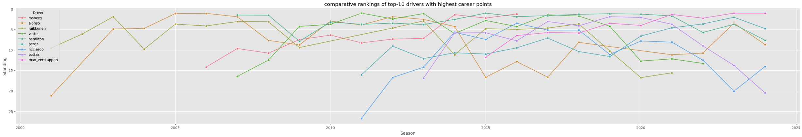

# Formula One Race Predictor


## Executive Summary

Formula 1 (F1) has been a competitive sport since 1950, shaped by substantive changes in technology and race regulations. This project leverages data science to analyse publicly available F1 data, to identify features that most influence race outcomes by creating supervised learning models to predict race finishing positions. Unlike similar Kaggle projects that focus on complex models like neural networks, this project emphasises Exploratory Data Analysis (EDA) to guide feature and model selection. 

The findings may be of use to betting companies where F1 betting is becoming a more popular (TODO: add source) - however, alternative data should be sought if used for commercial purposes.

## Data Source Selection
Data from the Ergast-MRD API (ERG-API) was chosen as it contains F1 data going back to the official start of the championships in 1950 to the present day and has a rich set of potential features / variables for analysis, as can be seen in the figure 1. It is publicly available and licensed for non-commercial purposes and is therefore permitted for use by this project (Ergast, 2024).

<sub>Figure 1 - Ergast API database entity relationship diagram (Ergast, 2024).</sup>

## Data Infrastructure and Tools
Python was selected as the programming language to take advantage of specialist Python libraries, including Numpy for manipulating data, Pandas for handling data, Matplotlib for generating visualizations, and Scikit-Learn for machine learning. VS Code was used for the Python IDE together with Jupyter Notebook extensions, to enable a step-by-step approach to processing data easier e.g. using cell-based execution of Python scripts. Both Python and VS Code are free to use and backed up by  commercial vendor support.

For extraction of source data, firewall restrictions in the organisational ecosystem prevented use of Python scripts to invoke the ERG-API directly. Unfortunately, this meant that an automated data pipeline was not possible which would have loaded latest F1 data into the predictive models. Instead, a workaround was put in place, consisting of downloading the data as static CSV text files (as at 07/102024) instead, which is also available from the ERG-API ["Motor Racing Data API"](https://ergast.com/mrd/db/). As well the latest data not being loaded, additional processing was required from the workaround as the ERG-API uses MySQL as a relational database and the dimension and fact tables are stored as separate CSV files, rather than putting the load onto the the MySQL database to retrieve query results, which would be more efficient. 

## The E2E Data Science Process
Figure 2 shows the end-to-end data science process including the data pipeline. The data pipeline played was pivotal to not only load the source data but also to check and treat data quality issues, and perform data transformations to aid analysis and feature engineering. Without the data pipeline performing such functions, the quality of Exploratory Data Analysis (EDA) to inform initialy business insights or inform model/feature selection or indeed model results may have been compromised.
 

<sub>Figure 2 - End-to-end data science process.</sup>

### Loading Source Data

The CSV files were loaded into a Pandas dataframe using the `pd.read_csv()` function from the Pandas library. Pandas was chosen as it offers functions for analyzing, cleaning, exploring, and manipulating data in a simple table-like structure for inspection, which makes it ideal for EDA (Altexsoft, 2024 - https://www.altexsoft.com/blog/pandas-library/). An example Python script for loading the drivers.csv text file is shown in figure 3.

```python
# Declare functions

# Function to load specific source data files into global variables
# TODO: Change data ingestion from loading static csv files to API calls.
def load_data():
  
    global df_drv

    try:
        df_drv = pd.read_csv('Data/drivers.csv')
    except FileNotFoundError:
        print("Error: 'drivers.csv' file not found.")
    except pd.errors.EmptyDataError:
        print("Error: 'drivers.csv' file is empty.")
    except Exception as e:
        print(f"Error loading 'drivers.csv': {e}")
```

```python
# Load source data
load_data()
```
<sub>Figure 3 - Python script for loading drivers.csv text file.</sup>

### Data Quality
The data pipeline identified and treated data quality issues where necessary e.g. checking and replacing missing values, checking and fixing incorrect data types. An example Python script for replacing missing values for the 'driverRef' column (stored as "\N" 'in drivers.csv') with "pd.NA", and changing the datatype for the 'dob' column is shown in figure 4. 

```python
# EDA for Drivers dataset: structure of the data & quality of the data - summary statistics & check uniqueness / missing values / datatype / format
stats = df_drv.describe()
print(df_drv.shape), print(df_drv), print(stats)

# Check 'number' column for missing values
df_drv['number'].unique

# Check 'driverRef' column for missing values
df_drv['driverRef'].unique

# Replace missing values ('\N') in 'number' column with 'NaN' and convert to numeric datatype
df_drv['number'] = df_drv['number'].replace('\\N', pd.NA)
df_drv['number'] = pd.to_numeric(df_drv['number'], errors='coerce')

# Fix datatypes for numerical or datetime columns
df_drv['dob'] = pd.to_datetime(df_drv['dob'])
```
<sub>Figure 4 - Python script for replacing missing values for 'driverRef' column and changing the datatype for the 'dob' column in the 'df_drv' pandas data frame.</sup>

### Data Transformations
The data pipeline also performed transformations to the data to reveal quick insights e.g. the 'df_results' and 'df_drv' data frames were merged together and grouped by 'driverRef' and 'points' to plot a bar chart showing the top-10 drivers with highest total career points (figure 5).

```python
# EDA for Drivers dataset: key business insight - top-10 drivers with highest career points

# Merge results with drivers to get 'driverRef'
df_pts = pd.merge(df_results, df_drv, on='driverId', how='right')

# Use 'driverRef' to calc total points
df_pts_grp = df_pts.groupby('driverRef')['points'].sum().reset_index()

# Remove drivers with no points
df_pts_grp_filtered = df_pts_grp[df_pts_grp['points'] > 0]

# Sorted from largest to smallest by points
df_pts_grp_sorted = df_pts_grp_filtered.sort_values(by='points', ascending=False)

# Filter for the top 10 drivers
df_top_drv = df_pts_grp_sorted.head(10)

# Plot bar chart
plt.figure(figsize=(45, 6))
sns.barplot(x='driverRef', y='points', data=df_top_drv)
plt.title('Top-10 drivers with highest career points')
plt.xlabel('Constructor')
plt.ylabel('Points')
plt.xticks(rotation=45)
plt.show()
```

<sub>Figure 5 - Python script for merging 'df_results' and 'df_drv' dataframes together, then grouping by 'driverRef' and 'points'.</sup>

## Exploratory Data Analysis
There was a consicous effort to conduct thorough EDA given the lack of F1 domain knowledge by the project author. Univariate Analysis (UA) was conducted on each column one table at a time to identify the structure of the each feature / variable e.g. size and shape, uniqueness, distribuion, outliers etc, and to surface quick insights e.g plotting relevant charts to visually show simple relationships between potential features and the target variable. These were then analysed further using Multivariate Analysis (MA) to identify more complex relationships between features and the target variable, and to inform final model and feature selection (Statology, 2024 - https://www.statology.org/univariate-vs-multivariate-analysis/). 

### Univariate Analysis (UA)
Key insights from UA underline the fact that many elements of F1 have changed since 1950. For example, in the USA different circuits have been raced at in different locations to make the sport more appealing to sports fans due to the popularity of basketball and baseball (figure 6). 
```python
# EDA for the Circuits table: meaning of the data - which countries have changed their circuits?

# Create count of number of circuits by country sorted from largest to smallest
df_circ_count = df_circuits['country'].value_counts().sort_values(ascending=False)

# Plot bar chart
plt.figure(figsize=(20, 6))
sns.barplot(x=df_circ_count.index, y=df_circ_count.values)
plt.title('Which countries have changed their circuits?')
plt.xlabel('Country')
plt.ylabel('Number of Races')
plt.xticks(rotation=45)
plt.show()
```

<sub>Figure 6 - Ordered bar chart showing number of race circuits by country.</sup>

Similarly, points awarded by season changed in 2003 and 2010 to make the sport more competitive and changes to the number of starting drivers as can be seen in figure 7 (Autosport, 2024 - [https://en.wikipedia.org/wiki/List_of_Formula_One_World_Championship_points_scoring_systems](https://www.autosport.com/f1/news/history-of-the-f1-points-system-with-proposed-structure-for-2025/10603210/)).
```python
# EDA for Results datase: key business insight - what is the total points awarded by season?

# Merge results with races to retrieve race 'year''
df_results = pd.merge(df_results, df_races, on='raceId', how='left', suffixes=('_res', '_race'))

# Use race 'year' to calc the total race points awarded for each season
df_total_points_by_season = df_results.groupby('year')['points'].sum().reset_index()

# Plot bar chart
plt.figure(figsize=(12, 8))
plt.bar(df_total_points_by_season['year'], df_total_points_by_season['points'], edgecolor='black')
plt.xlabel('Season')
plt.ylabel('Total Points Awarded')
plt.title('What is the total points awarded by season?')
plt.grid(True)
plt.show()
```

<sub>Figure 7 - Ordered bar chart showing total available points that could be awareed per season.</sup>

Completion of UA for other tables has highligted other significant changes in terms of circuits, races schedule, pit stops, and even lap times. This has partly been due to the development of technology and modern engineering but also as a result of cotinued changes to the sport as a whole (rules & egulations, points, etc) itself to make it more competitive and entertaining to spectators. *"Evolution is the lifeblood of Formula 1 - faster cars, safer cars, new circuits and fresh-faced world champions"* (source: http://www.bbc.co.uk/sport/formula1/21880627 & http://www.formulaonehistory.com). 

As a result of the lack of consistency of these features / variables, which would likely adversely impact the reliability of a predictive model, the decision was made to focus on driver-related features for the remaining analysis.

### Univariate Analysis for Driver-Related Features
UA was carried out for driver-related features, in particular, driver performance consistency and driver age.

Figure 8 uses an ordered bar-chart to show the drivers with the highest career points and figure 9 uses a line plot to show their relative rankings by season. Together, it can be inferred that a small proportion of the total driver population consistently achieves superior race results. Consequently, feature engineering was applied prior to modelling to create both short-term and long-term driver 'features', such as drivers winning the last race or drivers securing pole position in the last race, to simplify and speed up data transformations while also enhancing model accuracy (see Feature Engineering section).

```python
# EDA for Drivers dataset: key business insight - top-10 drivers with highest career points

# Merge results with drivers to get 'driverRef'
df_pts = pd.merge(df_results, df_drv, on='driverId', how='right')

# Use 'driverRef' to calc total points
df_pts_grp = df_pts.groupby('driverRef')['points'].sum().reset_index()

# Remove drivers with no points
df_pts_grp_filtered = df_pts_grp[df_pts_grp['points'] > 0]

# Sorted from largest to smallest by points
df_pts_grp_sorted = df_pts_grp_filtered.sort_values(by='points', ascending=False)

# Filter for the top 10 drivers
df_top_drv = df_pts_grp_sorted.head(10)

# Plot bar chart
plt.figure(figsize=(45, 6))
sns.barplot(x='driverRef', y='points', data=df_top_drv)
plt.title('Top-10 drivers with highest career points')
plt.xlabel('Constructor')
plt.ylabel('Points')
plt.xticks(rotation=45)
plt.show()
```

<sub>Figure 8 - Ordered bar chart showing drivers with highest career points.</sup>

```python
# EDA for Drivers dataset: key business insight - comparative rankings of top-10 drivers with highest career points

# Merge constructor standings with driver references
df_drv_rank = pd.merge(df_drv_standings, df_drv, on='driverId', how='right')
df_drv_rank = pd.merge(df_drv_rank, df_races, on='raceId', how='right')

# Use driver ref to filter for the top drivers based on total points earnt across all seassons
# TODO: Change from hard-coded 'driverRef' to ensure it is dynamically calculated
df_top_drv_rank = df_drv_rank[df_drv_rank['driverRef'].isin(['hamilton', 'vettel', 'max_verstappen', 'alonso', 'raikkonen', 'bottas', 'rosberg', 'perez', 'michael_schumacheer', 'ricciardo'])]

# Plot line plot
plt.figure(figsize=(40, 6))
sns.lineplot(x='year', y='position', hue='driverRef', data=df_top_drv_rank, marker='o', errorbar=None)
plt.title('comparative rankings of top-10 drivers with highest career points')
plt.xlabel('Season')
plt.ylabel('Standing')
plt.gca().invert_yaxis()  # Invert y-axis to have rank 1 at the top
plt.legend(title='Driver')
plt.show()
```

<sub>Figure 9 - Line plot showing reatlive rankings by season for drivers with highest career points.</sup>

Figure 10 uses a histogram to show the distribution of driver age at first race and at last race. Figure 11 also uses a histogram but to show the distribution of driver age for winning drivers only. Together, it can be inferred that driver performance is also dependent on driver age.
```python
# EDA for Drivers dataset: key business insight - What is the distribution of driver age when they first raced versus age when they last raced (in years)?

# Merge driver standings with drivers and races to retrieve dob
df_age1 = pd.merge(df_drv_standings, df_drv, on='driverId', how='right')
df_age2 = pd.merge(df_age1, df_races, on='raceId', how='right')

# Use dob to calculate driver date of first race & driver date of last race
df_age_grp = df_age2.groupby('driverId').agg(fr_date=('date', 'min'), lr_date=('date', 'max'), dob=('dob', 'first')).reset_index()

# Fix datatypes for numerical or datetime columns
df_age_grp['fr_date'] = pd.to_datetime(df_age_grp['fr_date'])
df_age_grp['lr_date'] = pd.to_datetime(df_age_grp['lr_date'])

# Feature engineering - use driver dob to calculate driver age at first race & age at last race
df_age_grp['age_first_race'] = (df_age_grp['fr_date'] - df_age_grp['dob']).dt.days // 365
df_age_grp['age_last_race'] = (df_age_grp['lr_date'] - df_age_grp['dob']).dt.days // 365

# Plot histogram
plt.figure(figsize=(10, 6))
plt.hist(df_age_grp['age_first_race'], alpha=0.5, label='Age at First Race')
plt.hist(df_age_grp['age_last_race'], alpha=0.5, label='Age at Last Race')
plt.title('What is the distribution of driver age when they first raced race vs. when they last raced (years)?')
plt.xlabel('Age (years)')
plt.ylabel('Count')
plt.xticks(rotation=45)
plt.legend(loc='upper right')
plt.show()

# Feature engineering - add age at first race & age at last race back to original dataset. 
df_drv = pd.merge(df_drv, df_age_grp, on='driverId', how='left')
```


<sub>Figure 10 - Histogram showing distribution of driver age at first race and last race.</sup>

```python
# EDA for Drivers dataset: key business insight - what is the distribution of winner driver age (in years)?

# Merge driver standings with drivers and races to retrieve dob for winning drivers
df_win_age1 = pd.merge(df_drv_standings[df_drv_standings['position'] == 1], df_drv, on='driverId', how='left')
df_win_age2 = pd.merge(df_win_age1, df_races, on='raceId', how='left')

# Ensure the date columns are in datetime format
df_win_age2['dob_x'] = pd.to_datetime(df_win_age2['dob_x'])
df_win_age2['date'] = pd.to_datetime(df_win_age2['date'])

# Use dob for winning drivers to calculate driver age at the time of the race
df_win_age2['race_age'] = (df_win_age2['date'] - df_win_age2['dob_x']).dt.days // 365
df_win_age2['race_age'] = df_win_age2['race_age'].astype(int)

# Plot histogram
plt.figure(figsize=(10, 6))
plt.hist(df_win_age2['race_age'].dropna(), bins=10, alpha=0.5, label='Race Win Age')
plt.title('What is the distribution of Winning Driver Age (years)?')
plt.xlabel('Age (years)')
plt.ylabel('Count')
plt.xticks(rotation=45)
plt.legend(loc='upper right')
plt.show()
```

<sub>Figure 11 - Histogram showing distribution of driver age for winning drivers only.</sup>

Figure 12 uses a box-plot to show potential driver age outliers fo winning drivers. 

12 uses a line plot to show the average driver age has been consistency lower in modern times.
```python
# EDA for Drivers dataset: key business insight - what is the typical age of winning drivers (years)?

# Plot box plot of driver age for race winners
plt.figure(figsize=(10, 6))
sns.boxplot(data=df_win_age2, y='race_age')
plt.title('What is the typical age of winning drivers (years)?')
plt.xlabel('Driver')
plt.ylabel('Age (years)')
plt.xticks(rotation=45)
plt.show()
```


<sub>Figure 12 - Box plot showing potential outliers for winning driver age.</sup>

Figure 13 uses a box plot to show the average driver age by season. Clearly, driver age has consistently declined over time and is much lower now than it was in 1950.
```python
# EDA for Drivers dataset: key business insight - what is the average driver age (years) by season?

# Merge driver standings with drivers and races to retrieve 'dob'
df_avg_age1 = pd.merge(df_drv_standings, df_drv, on='driverId', how='left')
df_avg_age2 = pd.merge(df_avg_age1, df_races[['raceId', 'year', 'date']], on='raceId', how='left')

# Convert 'dob' and race 'date' to datetime
df_avg_age2['dob_x'] = pd.to_datetime(df_avg_age2['dob_x'])
df_avg_age2['date'] = pd.to_datetime(df_avg_age2['date'])

# Calculate driver age in each race
df_avg_age2['age'] = df_avg_age2['date'].dt.year - df_avg_age2['dob_x'].dt.year

# Feature engineering - group by year and calculate the average age of drivers
df_avg_age_per_season = df_avg_age2.groupby('year')['age'].mean()

# Line Plot
plt.figure(figsize=(10, 6))
df_avg_age_per_season.plot(kind='line', marker='o')
plt.xlabel('Season')
plt.ylabel('Average Driver Age')
plt.title('What is the average driver age (years) by season?')
plt.grid(True)
plt.show()

# Feature engineering - add age at back to original dataset. 
df_drv = pd.merge(df_drv, df_age_grp, on='driverId', how='left')
```


<sub>Figure 13 - Line Plot showing average driver age by season.</sup>


### Multivariate Analysis
MA was conducted on the final data-frame containing driver performance variables, to check for correlation: a) visually using seaborn pair-plot to check for distribution, and b) calculating correlation coefficients in the form of a heat-map, where the strongest correlations are highlighted in ‘red’ (see figure 14). Both methods were used as linear regression models assume normal distribution of variables, linearity of variables and variable independence <insert code + diagrams>

### Feature Engineering
Consequently, feature engineering was employed to create long-term driver performance variables as well as short-term predictor driver performance variables (such as winning the last race or securing pole position in the last race) to serve as signals of driver consistency <insert code & diagrams>.

Feature engineering transformed provided new features for prediction (Jacob, 2024). New features evaluated driver performance both short and long term (see Figures 3 and 4). 

```python
# Feature Engineering: current_age

# Calc current age for each driver
df_drv['current_age'] = (pd.to_datetime('today') - df_drv['dob_x']).dt.days // 365
df_drv['current_age'] = df_drv['current_age'].astype(int)
```

```python
# Feature Engineering: avg_career_wins

# Calc total wins for each driver
df_results['wins'] = df_results['position'] == 1
df_total_wins = df_results.groupby('driverId')['wins'].sum().reset_index()

# Calc total races for each driver
df_total_races = df_results.groupby('driverId')['raceId'].count().reset_index()
df_total_races.columns = ['driverId', 'total_races']

# Merge total wins and total races
df_drv_wins = pd.merge(df_total_wins, df_total_races, on='driverId')

# Calc average number of career wins
df_drv_wins['avg_career_wins'] = df_drv_wins['wins'] / df_drv_wins['total_races']

# Add avg_career_wins back to df_drv dataframe
df_drv = pd.merge(df_drv, df_drv_wins[['driverId', 'avg_career_wins']], on='driverId', how='left')```

## Final Dataset
<insert diagram here>.

## Hypotheses
<insert diagram here>.

## Predictive Models
Three supervised learning models were used to predict race outcomes, each one attempting to improve results from the previous one.
```

```python
# Feature Engineering: avg_career_pole_pos

# Calc total pole positions for each driver
df_results['pole_pos'] = df_results['grid'] == 1
df_total_pole_pos = df_results.groupby('driverId')['pole_pos'].sum().reset_index()

# Merge total pole positions and total races
df_drv_pole_pos = pd.merge(df_total_pole_pos, df_total_races, on='driverId')

# Calc average number of pole positions
df_drv_pole_pos['avg_career_pole_pos'] = df_drv_pole_pos['pole_pos'] / df_drv_pole_pos['total_races']

# Add avg_career_pole_pos back to df_drv dataframe
df_drv = pd.merge(df_drv, df_drv_pole_pos[['driverId', 'avg_career_pole_pos']], on='driverId', how='left')
```

```python
# Feature Engineering: avg_career_top3_grid_pos

# Calc total top-3 grid positions for each driver
df_results['top3_grid_pos'] = df_results['grid'].isin([1, 2, 3])
df_total_top3_grid_pos = df_results.groupby('driverId')['top3_grid_pos'].sum().reset_index()

# Merge total top-3 grid positions and total races
df_drv_grid_pos = pd.merge(df_total_top3_grid_pos, df_total_races, on='driverId')

# Calc average number of top-3 grid positions
df_drv_grid_pos['avg_career_top3_grid_pos'] = df_drv_grid_pos['top3_grid_pos'] / df_drv_grid_pos['total_races']

# Add avg_career_top3_grid_pos back to df_drv dataframe
df_drv = pd.merge(df_drv, df_drv_grid_pos[['driverId', 'avg_career_top3_grid_pos']], on='driverId', how='left')
```

```python
# Feature Engineering: Add drv_won_last_race column

# Merge results with races to retrieve race season
df_res = pd.merge(df_results, df_races, on='raceId', how='left')

# Sort all race results by driver + year + race id
df_res = df_res.sort_values(['driverId', 'year_x', 'raceId'])

# Use window funtion to calc whether driver won last race by seeing if previous race result position was first
df_drv['won_last_race'] = df_res.groupby('driverId')['position'].shift(1) == 1
df_drv['won_last_race'] = df_drv['won_last_race'].fillna(False).astype(int)
```

```python
# Feature Engineering: Add drv_pole_pos_last_race column

# Merge results with races to retrieve race season
df_res = pd.merge(df_results, df_races, on='raceId', how='left')

# Sort all race results by driver + year + race id
df_res = df_res.sort_values(['driverId', 'year_x', 'raceId'])

# Use window function to calc whether driver has pole position for last race by seeing if previous race grid position was first
df_drv['pole_pos_last_race'] = df_res.groupby('driverId')['grid'].shift(1) == 1
df_drv['pole_pos_last_race'] = df_drv['pole_pos_last_race'].fillna(False).astype(int)```
