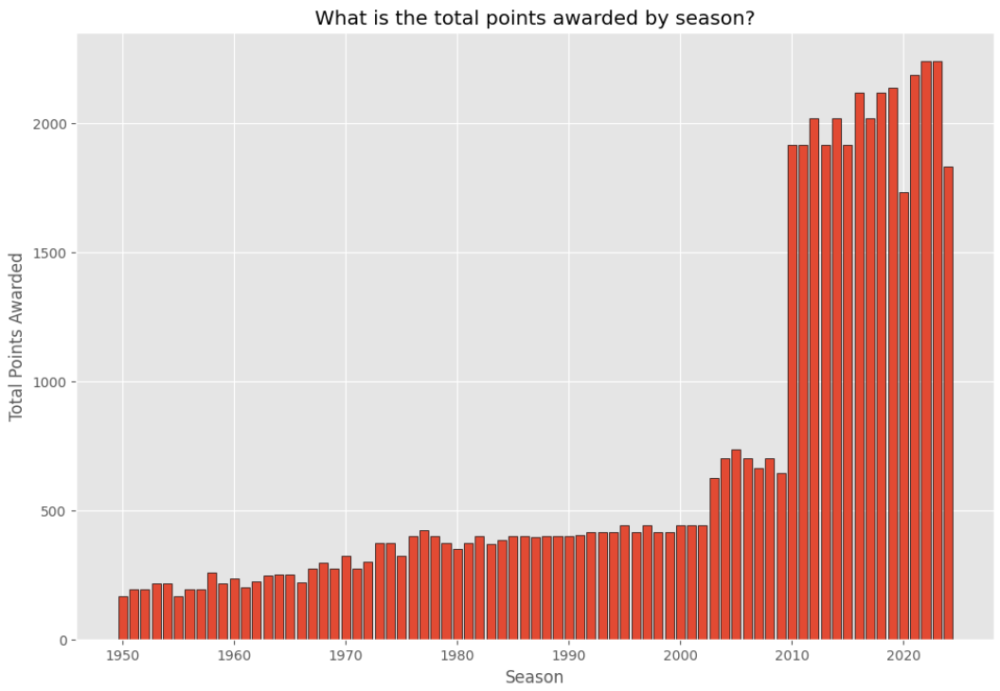
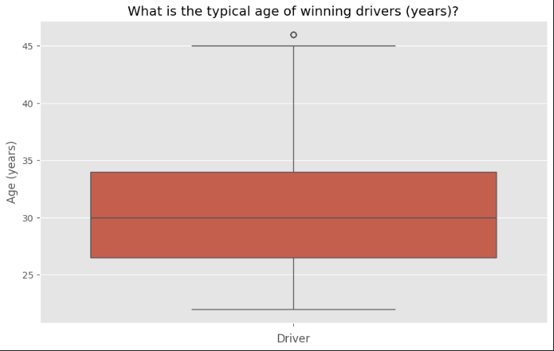
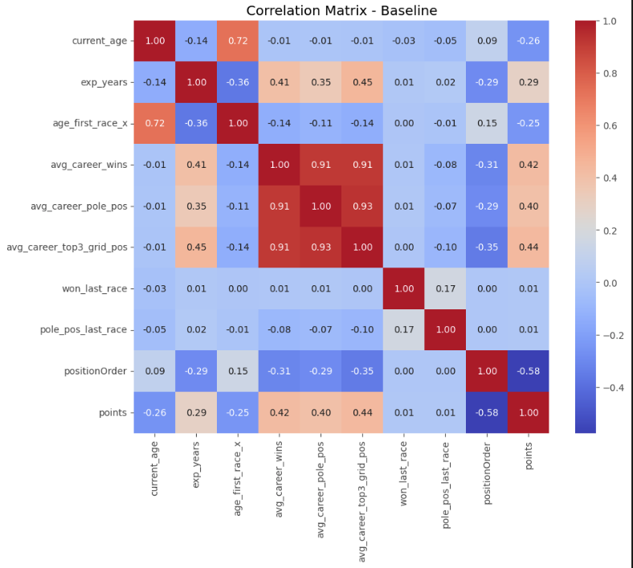
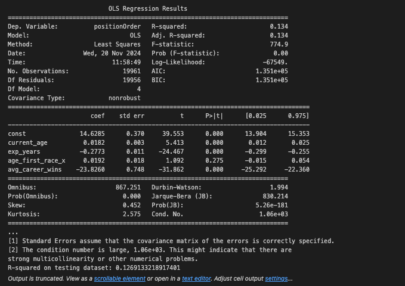

# Formula One Race Predictor


## L1 - Executive Summary

Formula 1 (F1) has been a competitive sport since 1950, shaped by substantive changes in technology and race regulations. This project leverages data science to analyse publicly available F1 data, to identify features that most influence race outcomes by creating supervised learning models to predict race finishing positions. Unlike similar Kaggle projects that focus on complex models like neural networks, this project emphasises Exploratory Data Analysis (EDA) to guide feature and model selection. 

Two regression models were used to test the hypothesis that consistent career performance and age are the most significant features incluencing 'race finishing positions'. A gradient boosted decision tree (XGBoost) was then implemented on the basis that such models are better at handling non-lineartiy - this improved accuracy to within 4 race positions. For supervised learning, it is common to split the data into 'train' vs 'test' datasets to validate how well the learnt model performs on a set of new data (Raheja, 2024). The 'test' set effectively simulates new data. 'Race positions' was selected as the target variable, given that EDA showed that race points awarded have changed since 1950 and to allow for the new race sprint format, introduced in 2021.

Since this project started, the 2024 F1 race season has finished. The winner was Max Verstappen, who won his 4th championship title. Verstappen is 27 yrs old and well known for his agressive driving style whereas Lewis Hamilton finished 9th at the age of 39 despite having won 7 titles during his career. Therefore, deeper analysis is recommended to investigate the hypothesis that driver dynamics and attitude to risk are also significant.

## L1 - Data Source Selection
Data from the Ergast-MRD API (ERG-API) was chosen as it contains F1 data going back to the official start of the championships in 1950 to the present day and has a rich set of potential features / variables for analysis, as can be seen in the figure 1. It is publicly available and licensed for non-commercial purposes and is therefore permitted for use by this project (Ergast, 2024).

<sub>Figure 1 - Ergast API database entity relationship diagram (Ergast, 2024).</sub>

## L1 - Methods

### L2 - Data Infrastructure and Tools
Python was selected as the programming language to take advantage of specialist Python libraries, including Numpy for manipulating data, Pandas for handling data, Matplotlib for generating visualizations, and Scikit-Learn for machine learning. VS Code was used for the Python IDE together with Jupyter Notebook extensions, to enable a step-by-step approach to processing data easier e.g. using cell-based execution of Python scripts. Both Python and VS Code are free to use and backed up by commercial vendor support.

For extraction of source data, firewall restrictions in the organisational ecosystem prevented use of Python scripts to invoke the ERG-API directly. Unfortunately, this meant that an automated data pipeline was not possible which would have loaded latest F1 data into the predictive models. Instead, a workaround was put in place, consisting of downloading the data as static CSV text files (as at 07/102024) instead, which is also available from the ERG-API ["Motor Racing Data API"](https://ergast.com/mrd/db/). As well the latest data not being loaded, additional processing was required from the workaround as the ERG-API uses MySQL as a relational database and the dimension and fact tables are stored as separate CSV files, rather than putting the load onto the MySQL database to retrieve query results, which would be more efficient. 

### L2 - E2E Data Science Process
Figure 2 shows the end-to-end data science process including the data pipeline. The data pipeline played was pivotal to not only load the source data but also to check and treat data quality issues and perform data transformations to aid analysis and feature engineering. Without the data pipeline performing such functions, the quality of Exploratory Data Analysis (EDA) to inform initially business insights or inform model/feature selection or indeed model results may have been compromised.
 

<sub>Figure 2 - End-to-end data science process.</sub>

#### L3 - Loading Source Data

The CSV files were loaded into a Pandas dataframe using the `pd.read_csv()` function from the Pandas library. Pandas was chosen as it offers functions for analysing, cleaning, exploring, and manipulating data in a simple table-like structure for inspection, which makes it ideal for EDA (Altexsoft, 2024). An example Python script for loading the drivers.csv text file is shown in figure 3.

```python
# Declare functions

# Function to load specific source data files into global variables
# TODO: Change data ingestion from loading static csv files to API calls.
def load_data():
  
    global df_drv

    try:
        df_drv = pd.read_csv('Data/drivers.csv')
    except FileNotFoundError:
        print("Error: 'drivers.csv' file not found.")
    except pd.errors.EmptyDataError:
        print("Error: 'drivers.csv' file is empty.")
    except Exception as e:
        print(f"Error loading 'drivers.csv': {e}")
```

```python
# Load source data
load_data()
```
<sup>Figure 3 - Python script for loading drivers.csv text file.</sup>

#### L3 - Data Quality
The data pipeline identified and treated data quality issues where necessary e.g. checking and replacing missing values, checking and fixing incorrect data types. An example Python script for replacing missing values for the 'driverRef' column (stored as "\N" 'in drivers.csv') with "pd.NA" and changing the datatype for the 'dob' column is shown in figure 4. 

```python
# EDA for Drivers dataset: structure of the data & quality of the data - summary statistics & check uniqueness / missing values / datatype / format
stats = df_drv.describe()
print(df_drv.shape), print(df_drv), print(stats)

# Check 'number' column for missing values
df_drv['number'].unique

# Check 'driverRef' column for missing values
df_drv['driverRef'].unique

# Replace missing values ('\N') in 'number' column with 'NaN' and convert to numeric datatype
df_drv['number'] = df_drv['number'].replace('\\N', pd.NA)
df_drv['number'] = pd.to_numeric(df_drv['number'], errors='coerce')

# Fix datatypes for numerical or datetime columns
df_drv['dob'] = pd.to_datetime(df_drv['dob'])
```
<sup>Figure 4 - Python script to replace missing values for 'driverRef' and chang datatype for 'dob'.</sup>

#### L3 - Data Transformations
The data pipeline also performed transformations to the data to reveal quick insights e.g. the 'df_results' and 'df_drv' data frames were merged together and grouped by 'driverRef' and 'points' to plot a bar chart showing the top-10 drivers with highest total career points (figure 5).

```python
# EDA for Drivers dataset: key business insight - top-10 drivers with highest career points

# Merge results with drivers to get 'driverRef'
df_pts = pd.merge(df_results, df_drv, on='driverId', how='right')

# Use 'driverRef' to calc total points
df_pts_grp = df_pts.groupby('driverRef')['points'].sum().reset_index()

# Remove drivers with no points
df_pts_grp_filtered = df_pts_grp[df_pts_grp['points'] > 0]

# Sorted from largest to smallest by points
df_pts_grp_sorted = df_pts_grp_filtered.sort_values(by='points', ascending=False)

# Filter for the top 10 drivers
df_top_drv = df_pts_grp_sorted.head(10)

# Plot bar chart
plt.figure(figsize=(45, 6))
sns.barplot(x='driverRef', y='points', data=df_top_drv)
plt.title('Top-10 drivers with highest career points')
plt.xlabel('Constructor')
plt.ylabel('Points')
plt.xticks(rotation=45)
plt.show()
```

<sup>Figure 5 - Python script to merge 'df_results' and 'df_drv' together, then grouping by 'driverRef' and 'points'.</sup>

### L2 - Exploratory Data Analysis
There was a conscious effort to conduct thorough EDA given the lack of F1 domain knowledge by the project author. Univariate Analysis (UA) was conducted on each column one table at a time to identify the structure of each feature / variable e.g. size and shape, uniqueness, distribution, outliers etc, and to surface quick insights e.g. plotting relevant charts to visually show simple relationships between potential features and the target variable. These were then analysed further using Multivariate Analysis (MA) to identify more complex relationships between features and the target variable, and to inform final model and feature selection (Statology, 2022). 

### L2 - Model Selection & Preparatiion
Two regression models were used to test the hypothesis that consistent career performance and age are the most significant features influenging 'race finishinig positions'. A gradient boosted decision tree (XGBoost) was them implemented on the basis that such model are better at handling non-linearity - this improved accuracy to within 4 race positions.

For supervised learning, it is commoon to split the data into 'train' vs 'test' datasets to validate how well the learnt model performs on a set of new data (Rajeha, 2024). The 'test' data effectively simulates new data. 'Race posistion order' was selected as the target variable, given that EDA showed that race points have changed since 1950.

### L1 - Results

### L2 - EDA - Univariate Analysis (UA)
Key insights from UA underline the fact that many elements of F1 have changed since 1950. For example, in the USA different circuits have been raced at in different locations to make the sport more appealing to sports fans due to the popularity of basketball and baseball (figure 6). 
```python
# EDA for the Circuits table: meaning of the data - which countries have changed their circuits?

# Create count of number of circuits by country sorted from largest to smallest
df_circ_count = df_circuits['country'].value_counts().sort_values(ascending=False)

# Plot bar chart
plt.figure(figsize=(20, 6))
sns.barplot(x=df_circ_count.index, y=df_circ_count.values)
plt.title('Which countries have changed their circuits?')
plt.xlabel('Country')
plt.ylabel('Number of Races')
plt.xticks(rotation=45)
plt.show()
```

<sup>Figure 6 - Ordered bar chart showing number of race circuits by country.</sup>

Similarly, points awarded by season changed in 2003 and 2010 to make the sport more competitive and introduce changes to the number of starting drivers as can be seen in figure 7 (Autosport, 2024).
```python
# EDA for Results datase: key business insight - what is the total points awarded by season?

# Merge results with races to retrieve race 'year''
df_results = pd.merge(df_results, df_races, on='raceId', how='left', suffixes=('_res', '_race'))

# Use race 'year' to calc the total race points awarded for each season
df_total_points_by_season = df_results.groupby('year')['points'].sum().reset_index()

# Plot bar chart
plt.figure(figsize=(12, 8))
plt.bar(df_total_points_by_season['year'], df_total_points_by_season['points'], edgecolor='black')
plt.xlabel('Season')
plt.ylabel('Total Points Awarded')
plt.title('What is the total points awarded by season?')
plt.grid(True)
plt.show()
```

<sup>Figure 7 - Ordered bar chart showing total points awarded by season.</sup>

Completion of UA for other tables has highlighted other significant changes in terms of circuits, races schedule, pit stops, and even lap times. This has partly been due to the development of technology and modern engineering but also as a result of continued changes to the sport as a whole (rules & regulations, points, etc) itself to make it more competitive and entertaining to spectators. *"Evolution is the lifeblood of Formula 1 - faster cars, safer cars, new circuits and fresh-faced world champions" (BBC, 2014). 

As a result of the lack of consistency of these features / variables, which would likely adversely impact the reliability of a predictive model, the decision was made to focus on driver-related features for the remaining analysis.

### L2 - Univariate Analysis for Driver-Related Features (UA-D)
Figure 8 uses an ordered bar-chart to show the drivers with the highest career points and figure 9 uses a line plot to show their relative rankings by season. Together, these quick insights indicate that consistency of driver performance might be a potential deterministic factor for race outcomes. 

Nb. Consequently, feature engineering was applied prior to modelling to create both short-term and long-term driver features, such as drivers winning the last race or drivers securing pole position in the last race, to simplify and speed up data transformations while also enhancing model accuracy (see Feature Engineering section).

```python
# EDA for Drivers dataset: key business insight - top-10 drivers with highest career points

# Merge results with drivers to get 'driverRef'
df_pts = pd.merge(df_results, df_drv, on='driverId', how='right')

# Use 'driverRef' to calc total points
df_pts_grp = df_pts.groupby('driverRef')['points'].sum().reset_index()

# Remove drivers with no points
df_pts_grp_filtered = df_pts_grp[df_pts_grp['points'] > 0]

# Sorted from largest to smallest by points
df_pts_grp_sorted = df_pts_grp_filtered.sort_values(by='points', ascending=False)

# Filter for the top 10 drivers
df_top_drv = df_pts_grp_sorted.head(10)

# Plot bar chart
plt.figure(figsize=(45, 6))
sns.barplot(x='driverRef', y='points', data=df_top_drv)
plt.title('Top-10 drivers with highest career points')
plt.xlabel('Constructor')
plt.ylabel('Points')
plt.xticks(rotation=45)
plt.show()
```

<sup>Figure 8 - Ordered bar chart showing drivers with highest career points.</sup>

```python
# EDA for Drivers dataset: key business insight - comparative rankings of top-10 drivers with highest career points

# Merge constructor standings with driver references
df_drv_rank = pd.merge(df_drv_standings, df_drv, on='driverId', how='right')
df_drv_rank = pd.merge(df_drv_rank, df_races, on='raceId', how='right')

# Use driver ref to filter for the top drivers based on total points earnt across all seassons
# TODO: Change from hard-coded 'driverRef' to ensure it is dynamically calculated
df_top_drv_rank = df_drv_rank[df_drv_rank['driverRef'].isin(['hamilton', 'vettel', 'max_verstappen', 'alonso', 'raikkonen', 'bottas', 'rosberg', 'perez', 'michael_schumacheer', 'ricciardo'])]

# Plot line plot
plt.figure(figsize=(40, 6))
sns.lineplot(x='year', y='position', hue='driverRef', data=df_top_drv_rank, marker='o', errorbar=None)
plt.title('comparative rankings of top-10 drivers with highest career points')
plt.xlabel('Season')
plt.ylabel('Standing')
plt.gca().invert_yaxis()  # Invert y-axis to have rank 1 at the top
plt.legend(title='Driver')
plt.show()
```

<sup>Figure 9 - Line plot showing relative rankings by season for drivers with highest career points.</sup>

Figure 10 uses a histogram to show the distribution of driver age at first race and at last race. Figure 11 also uses a histogram but to show the distribution of driver age for winning drivers only. Together, these quick insights indicate that driver age might be a potential deterministic factor for race outcomes.
```python
# EDA for Drivers dataset: key business insight - What is the distribution of driver age when they first raced versus age when they last raced (in years)?

# Merge driver standings with drivers and races to retrieve dob
df_age1 = pd.merge(df_drv_standings, df_drv, on='driverId', how='right')
df_age2 = pd.merge(df_age1, df_races, on='raceId', how='right')

# Use dob to calculate driver date of first race & driver date of last race
df_age_grp = df_age2.groupby('driverId').agg(fr_date=('date', 'min'), lr_date=('date', 'max'), dob=('dob', 'first')).reset_index()

# Fix datatypes for numerical or datetime columns
df_age_grp['fr_date'] = pd.to_datetime(df_age_grp['fr_date'])
df_age_grp['lr_date'] = pd.to_datetime(df_age_grp['lr_date'])

# Feature engineering - use driver dob to calculate driver age at first race & age at last race
df_age_grp['age_first_race'] = (df_age_grp['fr_date'] - df_age_grp['dob']).dt.days // 365
df_age_grp['age_last_race'] = (df_age_grp['lr_date'] - df_age_grp['dob']).dt.days // 365

# Plot histogram
plt.figure(figsize=(10, 6))
plt.hist(df_age_grp['age_first_race'], alpha=0.5, label='Age at First Race')
plt.hist(df_age_grp['age_last_race'], alpha=0.5, label='Age at Last Race')
plt.title('What is the distribution of driver age when they first raced race vs. when they last raced (years)?')
plt.xlabel('Age (years)')
plt.ylabel('Count')
plt.xticks(rotation=45)
plt.legend(loc='upper right')
plt.show()

# Feature engineering - add age at first race & age at last race back to original dataset. 
df_drv = pd.merge(df_drv, df_age_grp, on='driverId', how='left')
```


<sup>Figure 10 - Histogram showing distribution of driver age at first race and last race.</sup>

```python
# EDA for Drivers dataset: key business insight - what is the distribution of winner driver age (in years)?

# Merge driver standings with drivers and races to retrieve dob for winning drivers
df_win_age1 = pd.merge(df_drv_standings[df_drv_standings['position'] == 1], df_drv, on='driverId', how='left')
df_win_age2 = pd.merge(df_win_age1, df_races, on='raceId', how='left')

# Ensure the date columns are in datetime format
df_win_age2['dob_x'] = pd.to_datetime(df_win_age2['dob_x'])
df_win_age2['date'] = pd.to_datetime(df_win_age2['date'])

# Use dob for winning drivers to calculate driver age at the time of the race
df_win_age2['race_age'] = (df_win_age2['date'] - df_win_age2['dob_x']).dt.days // 365
df_win_age2['race_age'] = df_win_age2['race_age'].astype(int)

# Plot histogram
plt.figure(figsize=(10, 6))
plt.hist(df_win_age2['race_age'].dropna(), bins=10, alpha=0.5, label='Race Win Age')
plt.title('What is the distribution of Winning Driver Age (years)?')
plt.xlabel('Age (years)')
plt.ylabel('Count')
plt.xticks(rotation=45)
plt.legend(loc='upper right')
plt.show()
```


<sup>Figure 11 - Histogram showing distribution of driver age for winning drivers only.</sup>

Figure 12 uses a box-plot to show driver age outliers for winning drivers and figure 13 uses a box-plot to show the average driver age by season. Clearly, driver age has consistently declined over time and is much lower now than it was in 1950. Together, they indicate that driver age was much higher when the sport started compared to the modern era - this is a key consideration for model 1 vs model2.

```python
# EDA for Drivers dataset: key business insight - what is the typical age of winning drivers (years)?

# Plot box plot of driver age for race winners
plt.figure(figsize=(10, 6))
sns.boxplot(data=df_win_age2, y='race_age')
plt.title('What is the typical age of winning drivers (years)?')
plt.xlabel('Driver')
plt.ylabel('Age (years)')
plt.xticks(rotation=45)
plt.show()
```


<sup>Figure 12 - Box plot showing outliers for winning driver age.</sup>

```python
# EDA for Drivers dataset: key business insight - what is the average driver age (years) by season?

# Merge driver standings with drivers and races to retrieve 'dob'
df_avg_age1 = pd.merge(df_drv_standings, df_drv, on='driverId', how='left')
df_avg_age2 = pd.merge(df_avg_age1, df_races[['raceId', 'year', 'date']], on='raceId', how='left')

# Convert 'dob' and race 'date' to datetime
df_avg_age2['dob_x'] = pd.to_datetime(df_avg_age2['dob_x'])
df_avg_age2['date'] = pd.to_datetime(df_avg_age2['date'])

# Calculate driver age in each race
df_avg_age2['age'] = df_avg_age2['date'].dt.year - df_avg_age2['dob_x'].dt.year

# Feature engineering - group by year and calculate the average age of drivers
df_avg_age_per_season = df_avg_age2.groupby('year')['age'].mean()

# Line Plot
plt.figure(figsize=(10, 6))
df_avg_age_per_season.plot(kind='line', marker='o')
plt.xlabel('Season')
plt.ylabel('Average Driver Age')
plt.title('What is the average driver age (years) by season?')
plt.grid(True)
plt.show()

# Feature engineering - add age at back to original dataset. 
df_drv = pd.merge(df_drv, df_age_grp, on='driverId', how='left')
```


<sup>Figure 13 - Line Plot showing average driver age by season.</sup>

### L2 - Multivariate Analysis
MA was conducted on the final dataframe containing driver performance features. Correlation coefficients were calculated and visually plotted using a colour-coded heatmap where the strongest correlations are highlighted in ‘red’ (see figure 15). The reason for doing this was to check model assumptions forlinear regression models i.e. features / variables have a normal distribution, linearity of variables and variable independence (Robert J Casson & Lachlan, 2014). Those feature with high correlation could indicate multi-collinearity and were thus removed from the final dataframe.



<sup>Figure 15 - Heatmap to show correlation coefficients for final dataframe.</sup>

MA was repeated without the highly correlated feaures as shown in figure 16. This was used as the final dataset as input into the predictive models (Figure 16).


<sup>Figure 16 - Heatmap to show correlation coefficients for final dataframe minus highly correlated features.</sup>


### Exploratory Data Analysis
Two regression models were used to test the hypothesis that consistent career performance and age are the most significant features incluencing 'race finishing positions'. A gradient boosted decision tree (XGBoost) was then implemented on the basis that such models are better at handling non-lineartiy - this improved accuracy to within 4 race positions.
For supervised learning, it is common to split the data into 'train' vs 'test' datasets to validate how well the learnt model performs on a set of new data (Raheja, 2024). The 'test' set effectively simulates new data. 'Race positions' was selected as the target variable, given that EDA showed that race points awarded have changed since 1950 and to allow for the new race sprint format, introduced in 2021.

### Feature Engineering
As a result of UA for driver-related features, feaure engineering was used to produce new features related to short-term and long-term driver performance (Jacob, 2024). Two examples of this are shown in figures 14 and 15.

```python
# Feature Engineering: avg_career_wins

# Calc total wins for each driver
df_results['wins'] = df_results['position'] == 1
df_total_wins = df_results.groupby('driverId')['wins'].sum().reset_index()

# Calc total races for each driver
df_total_races = df_results.groupby('driverId')['raceId'].count().reset_index()
df_total_races.columns = ['driverId', 'total_races']

# Merge total wins and total races
df_drv_wins = pd.merge(df_total_wins, df_total_races, on='driverId')

# Calc average number of career wins
df_drv_wins['avg_career_wins'] = df_drv_wins['wins'] / df_drv_wins['total_races']

# Add avg_career_wins back to df_drv dataframe
df_drv = pd.merge(df_drv, df_drv_wins[['driverId', 'avg_career_wins']], on='driverId', how='left')```
```
<sup>Figure 14 - Feature engineering to calculate average career wins by driver.</sup>

```python
# Feature Engineering: Add drv_won_last_race column

# Merge results with races to retrieve race season
df_res = pd.merge(df_results, df_races, on='raceId', how='left')

# Sort all race results by driver + year + race id
df_res = df_res.sort_values(['driverId', 'year_x', 'raceId'])

# Use window funtion to calc whether driver won last race by seeing if previous race result position was first
df_drv['won_last_race'] = df_res.groupby('driverId')['position'].shift(1) == 1
df_drv['won_last_race'] = df_drv['won_last_race'].fillna(False).astype(int)
```
<sup>Figure 15 - Feature engineering to calculate whether a driver won the last race.</sup>

### Predictive Modellling

#### PRED_MDL01 - Multi Linear Regression Model
MDL01 used Multi Linear Regression (MLR) to analyse the predictor variables affecting the target variable and determine if relationships were negative or positive (figure 17). The model produced an R-squared value of 0.134, showing that 13.4% of the variation in race finishing positions was explained. The 'age_first_race_x' variable was not statistically significant (p-value > 0.05) and should be removed in future iterations. The mean absolute error (MAE) was 5.94, indicating race predictions were accurate within plus or minus 5.9 positions.

```python
# Split data into train and test data
X1 = df_dp_vars_nan2[['current_age', 'exp_years', 'age_first_race_x', 'avg_career_wins']]
y1 = df_dp_vars_nan2[['positionOrder']]

X1_train, X1_test, y1_train, y1_test = train_test_split(X1, y1, test_size=0.25, random_state=101)

# Convert train and test datasets into DataFrames
X1_train = pd.DataFrame(X1_train)
X1_test = pd.DataFrame(X1_test)

# Add constant (intercept) to predictor variables for the training set
X1_train = sm.add_constant(X1_train)
X1_test = sm.add_constant(X1_test)

# Train the model
model1 = sm.OLS(y1_train, X1_train).fit()
print(model1.summary())

# Evalute model performance
y1_pred = model1.predict(X1_test)
r1_sqr_test = r2_score(y1_test, y1_pred)
print(f'R-squared on testing dataset: {r1_sqr_test}')
```


<sup>Figure 17 - Model 1 results.</sup>

#### PRED_MDL02 - Multi Linear Regression Model (Minus driver age outliers)
Removing driver age outliers from MDL01 to create MDL02 (figure 18) improved the R-squared to 0.219, explaining 22% of the variation in race finishes. All predictors, including 'age_first_race_x', were significant (p < 0.05). The Mean Absolute Error (MAE) improved to 4.29, indicating predictions were accurate within ±4.3 positions.

```python
# Decision: Remove outliers for age_at_first_race_x & age_at_last_race
df_filtered = df_dp_vars_nan1[df_dp_vars_nan1['current_age'] <= 45]
df_dp_no_age_outliers = df_filtered[['current_age', 'exp_years', 'age_first_race_x', 'avg_career_wins', 'positionOrder']]

# Split data into train and test data sets
X2 = df_dp_no_age_outliers[['current_age', 'exp_years', 'age_first_race_x', 'avg_career_wins']]
y2 = df_dp_no_age_outliers[['positionOrder']]

# Split the data
X2_train, X2_test, y2_train, y2_test = train_test_split(X2, y2, test_size=0.25, random_state=101)

# Convert train and test datasets into DataFrames
X2_train = pd.DataFrame(X2_train)
X2_test = pd.DataFrame(X2_test)

# Add constant (intercept) to predictor variables for the training set
X2_train = sm.add_constant(X2_train)
X2_test = sm.add_constant(X2_test)

# Train the model
model2 = sm.OLS(y2_train, X2_train).fit()
print(model2.summary())

# Evaluate model peformance
y2_pred = model2.predict(X2_test)
r2_sqr_test = r2_score(y2_test, y2_pred)
print(f'R-squared on testing dataset: {r2_sqr_test}')
```


<sup>Figure 18 - Model 2 results.</sup>

#### PRED_MDL03 - XGBoost Model (Minus driver age outliers)
An XGBoost model was used for MDL03 (figure 19) to handle non-linear relationships and feature interactions. The R2 coefficient improved to 0.311, explaining 31% of the variation in race finishing positions. The model’s mean absolute error (MAE) was 4.09, indicating race predictions were accurate within ±4.1 positions.

```python
# Split data into train and test data sets
X3 = df_dp_no_age_outliers[['current_age', 'exp_years', 'age_first_race_x', 'avg_career_wins']]
y3 = df_dp_no_age_outliers[['positionOrder']]

# Split the data
X3_train, X3_test, y3_train, y3_test = train_test_split(X3, y3, test_size=0.25, random_state=101)

# Convert train and test data into DMatrix
dtrain = xgb.DMatrix(X3_train, label=y3_train)
dtest = xgb.DMatrix(X3_test, label=y3_test)

# Set parameters for XGBoost
params = {
    'objective': 'reg:squarederror',  # for regression task
    'max_depth': 6,
    'eta': 0.1,
    'subsample': 0.8,
    'colsample_bytree': 0.8,
    'seed': 101
}

# Train the model
model3 = xgb.train(params, dtrain, num_boost_round=100)

# Evalute model performance
y3_pred = model3.predict(dtest)
# r3_sqr_test = r2_score(y3_test, y3_pred)
# print(f'R-squared on testing dataset: {r3_sqr_test}')

# Predictions on training data
y3_train_pred = model3.predict(dtrain)

# Calculate R-squared for training data
r3_sqr_train = r2_score(y3_train, y3_train_pred)
print(f'R-squared on training dataset: {r3_sqr_train}')

# Predictions on test data
y3_test_pred = model3.predict(dtest)

# Calculate R-squared for test data
r3_sqr_test = r2_score(y3_test, y3_test_pred)
print(f'R-squared on testing dataset: {r3_sqr_test}')

# Evalute model results
# Calculate Mean Squared Error (MSE)
mse = mean_squared_error(y3_test, y3_pred)
print(f'Mean Squared Error (MSE): {mse}')

# Calculate Mean Absolute Error (MAE)
mae = mean_absolute_error(y3_test, y3_pred)
print(f'Mean Absolute Error (MAE): {mae}')
```


<sup>Figure 19 - Model 3 results.</sup>

## Conclusion
Analysing historical race data from 1950 to October 2024 revealed key factors affecting race outcomes: average career wins, experience, age at first race, and current age. The best model predicted race positions within plus or minus 4, explaining 31% of predictions.

Further research should explore how 'youth' and 'driver dynamics', including risk attitude, affect outcomes. Data could include reasons for not finishing, time/point penalties, and fastest lap times. Weather data could also reveal driver performance under different conditions.


